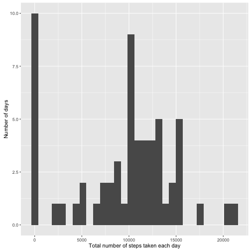
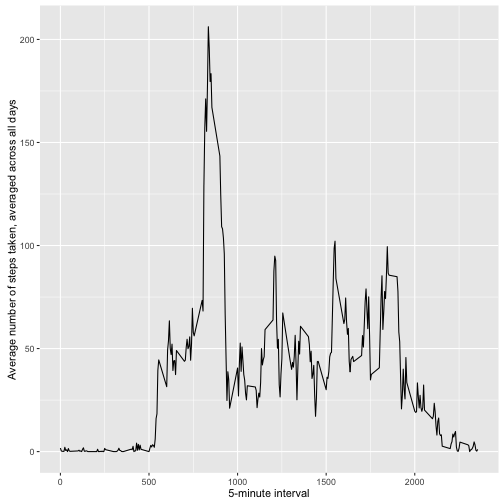
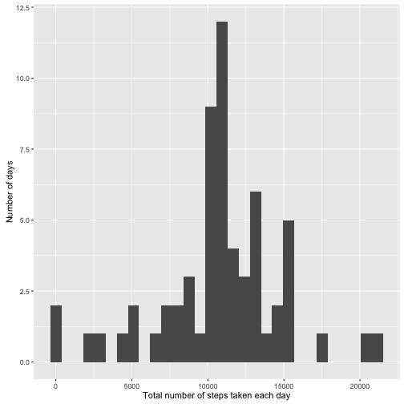
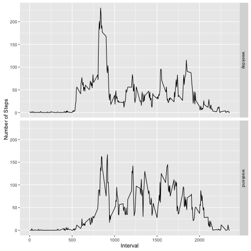

## Loading and preprocessing the data

Show any code that is needed to 

1. Load the data (i.e. read.csv())


```r
file <- read.csv(file="activity.csv",header=TRUE, colClasses = c("numeric","character","numeric"))
```

```
## Warning in file(file, "rt"): cannot open file 'activity.csv': No such file
## or directory
```

```
## Error in file(file, "rt"): cannot open the connection
```

2. Process/transform the data (if necessary) into a format suitable for your analysis

```r
library(dplyr)
library(lubridate)
file <- tbl_df(file)
file <- file %>% mutate(date = ymd(date)) 
```

## What is mean total number of steps taken per day?

For this part of the assignment, you can ignore the missing values in the dataset.

1. Calculate the total number of steps taken per day 

```r
total <- file %>% group_by(date) %>% summarise(total = sum(steps,na.rm=TRUE))
head(total)
```

```
## # A tibble: 6 <U+00D7> 2
##         date total
##       <date> <dbl>
## 1 2012-10-01     0
## 2 2012-10-02   126
## 3 2012-10-03 11352
## 4 2012-10-04 12116
## 5 2012-10-05 13294
## 6 2012-10-06 15420
```
2. If you do not understand the difference between a histogram and a barplot, research the difference between them. Make a histogram of the total number of steps taken each day. 

```r
library(ggplot2)
qplot(total$total,geom="histogram",xlab="Total number of steps taken each day",ylab="Number of days")
```

```
## `stat_bin()` using `bins = 30`. Pick better value with `binwidth`.
```

 
  
3. Calculate and report the mean and median of the total number of steps taken per day 


```r
total_mean <- mean(total$total,na.rm=TRUE)
total_median <- median(total$total,na.rm=TRUE)
```


```r
print(total_mean)
```

```
## [1] 9354.23
```

```r
print(total_median)
```

```
## [1] 10395
```

* Mean of the total number of steps taken per day: 9354.2295082
* Median of the total number of steps taken per day: 1.0395 &times; 10<sup>4</sup>

## What is the average daily activity pattern?

1. Make a time series plot (i.e. type="l") of the 5-minute interval (x-axis) and the average number of steps taken, averaged across all days (y-axis) .


```r
daily <- file %>% group_by(interval) %>% summarise(total = mean(steps,na.rm=TRUE))
head(daily)
```

```
## # A tibble: 6 <U+00D7> 2
##   interval     total
##      <dbl>     <dbl>
## 1        0 1.7169811
## 2        5 0.3396226
## 3       10 0.1320755
## 4       15 0.1509434
## 5       20 0.0754717
## 6       25 2.0943396
```

```r
qplot(x=daily$interval,y=daily$total,geom="line",xlab="5-minute interval", ylab="Average number of steps taken, averaged across all days")
```

 

2. Which 5-minute interval, on average across all the days in the dataset, contains the maximum number of steps? 


```r
interval_number <- (filter(daily,daily$total>=max(daily$total)))$total
interval_value <- (filter(daily,daily$total>=max(daily$total)))$interval
```

Answer: interval number 206.1698113 with an average of 835 steps.

## Imputing missing values

Note that there are a number of days/intervals where there are missing values (coded as NA). The presence of missing days may introduce bias into some calculations or summaries of the data.

1. Calculate and report the total number of missing values in the dataset (i.e. the total number of rows with NAs).

```r
number_na <- sum(is.na(file$steps))
```


```r
print(number_na)
```

```
## [1] 2304
```


Total number of rows with NAs: 2304

2. Devise a strategy for filling in all of the missing values in the dataset. The strategy does not need to be sophisticated. For example, you could use the mean/median for that day, or the mean for that 5-minute interval, etc. 


```r
# We will use the simple example: 
# When there is an NA, use the mean for that 5-minute interval
# See the next point for the code
```

3. Create a new dataset that is equal to the original dataset but with the missing data filled in.

```r
# do a join to find the average per interval
file2 <- file %>% left_join(daily, by = "interval") 

# replace NAs by the interval average
file2$steps[is.na(file2$steps)] <- file2$total[is.na(file2$steps)]

# select the same columns we had in the original file variable
file2 <- file2 %>% select(steps,date,interval)
```

4. Make a histogram of the total number of steps taken each day and Calculate and report the mean and median total number of steps taken per day. Do these values differ from the estimates from the first part of the assignment? What is the impact of imputing missing data on the estimates of the total daily number of steps?


```r
total2 <- file2 %>% group_by(date) %>% summarise(total2 = sum(steps,na.rm=TRUE))
head(total2)
```

```
## # A tibble: 6 <U+00D7> 2
##         date   total2
##       <date>    <dbl>
## 1 2012-10-01 10766.19
## 2 2012-10-02   126.00
## 3 2012-10-03 11352.00
## 4 2012-10-04 12116.00
## 5 2012-10-05 13294.00
## 6 2012-10-06 15420.00
```


```r
library(ggplot2)
qplot(total2$total2,geom="histogram",xlab="Total number of steps taken each day",ylab="Number of days")
```

```
## `stat_bin()` using `bins = 30`. Pick better value with `binwidth`.
```

 


```r
total2_mean <- mean(total2$total2,na.rm=TRUE)
total2_median <- median(total2$total2,na.rm=TRUE)
```


```r
print(total2_mean)
```

```
## [1] 10766.19
```

```r
print(total2_median)
```

```
## [1] 10766.19
```

* Mean of the total number of steps taken per day: 1.0766189 &times; 10<sup>4</sup>
* Median of the total number of steps taken per day: 1.0766189 &times; 10<sup>4</sup>

### The mean and median go up when replacing missing values by the average as estimation.

## Are there differences in activity patterns between weekdays and weekends?

For this part the weekdays() function may be of some help here. Use the dataset with the filled-in missing values for this part.

1. Create a new factor variable in the dataset with two levels- "weekday" and "weekend" indicating whether a given date is a weekday or weekend day.


```r
file2 <- file2 %>% mutate(weekday = factor(ifelse(weekdays(date) %in% c("Saturday", "Sunday"), "weekend", "weekday")) )
```

2. Make a panel plot containing a time series plot (i.e. type="l") of the 5-minute interval (x-axis) and the average number of steps taken, averaged across all weekday days or weekend days (y-axis). See the README file in the GitHub repository to see an example of what this plot should look like using simulated data.

```r
daily2 <- file2 %>% group_by(interval,weekday) %>% summarise(average = mean(steps,na.rm=TRUE))
qplot(interval,average,data=daily2,facets=weekday~.,geom="line",xlab="Interval",ylab="Number of Steps")
```

 

